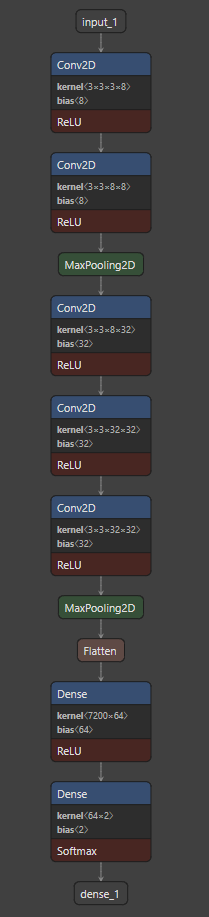

## 투명-불투명 자동 분리수거장치

### 작품 배경

https://news.seoul.go.kr/env/archives/510080

2020년 12월 25일부터 투명페트병 분리배출이 아파트와 같은 대단지세대에서 의무화 되었으며 21년 12월 25일부터는 단독주택 및 다가구 빌라도 의무화가 된다. 

이 정책을 보며 기존처럼 페트병을 일괄배출하면서 투명과 페트병을 분리배출 할 수 있으면 좋겠다는 생각으로 작품을 설계하게 됨

### 사용물품

* 젯슨나노
* 아두이노
* 리니어모터(LM4075)
* 리니어모터 모듈(DMC-15)  
* 초음파센서
* USB카메라
* 서보모터

### 작품설명

보는것과 같이 초음파센서로 물체를 확인하고 카메라로 사진을 찍는다.

이후 딥러닝 모델을 통해 투명, 불투명을 예측해 투명의 경우 리니어모터를 동작시켜 찌그러뜨리고 서보모터로 분리

불투명일경우 서보모터만 동작시켜 분리한다.

### 딥러닝 모델

### 힘들었던 점
젯슨나노 멈춤 and 꺼짐(발열문제? 로 추정)

젯슨나노에서 아두이노 인식문제(다수의 아두이노 사용때문?)
 -> try out문으로 해결함

딥러닝 예측시간이 너무 김 -> 기존 VGG16모델에서 Conv2 + Polling1 + Conv3 + Polling1 + Fully connected2로 바꿈,
 이미지를 600 * 400에서 60*60으로 바꿈 투명 불투명 색깔로만 인식하기 때문인지
큰 정확도 차이가 없었음
### 아쉬운 점

투명 페트병 찌그러뜨림이 너무 아쉬웠음 리니어모터 동작 시 찌그러지지만 다시 들어가면 페트병이 원상복구하는 점

초음파 -> 사진 -> 예측 -> 모터(리니어, 서보) 중 리니어 서보모터가 동작할 때 초음파 센서가 지속적으로 값을 입력받고 있어 데이터가 쌓이는 문제를 해결하려고 하다보니 동작시간이 너무 길어서 아쉬웠음

사진 데이터를 흰색배경에 라벨이없는 생수병과 생탁과 화장품 몇개만을 사용해서 모으고 Tensorflow의 ImageDataGenerator를 사용하여 이미지를 증가시키다 보니 흰 불투명페트병은 분류하지 못했고 뒤에 배경이 바뀌거나 주변 밝기에 의해 예측이 변화하는 모습도 있었다.

### 결과사진
